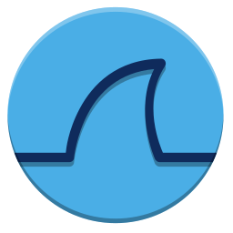

<h1> yo :wave:, I'm Isaac! 😎 </h1>
idk what to write here. repos are updated when i feel like it (never) 😴

  

## 📌 Current Projects
  <strong>

  - [Home Security Server](https://github.com/isaacward1/homeserv-sec)

  - [T-Pot Multi-Honeypot on Azure](https://isaacward1.github.io/posts/azure-tpot/)
  
  - DIY WireGuard
    
  </strong>
 

## 🚀 Future Projects
  <strong>

  - DNS query monitor (tcpdump, VirusTotal API)

  - Packet Tracer stuff

  - HTML Source Summarizer/JS Inspector

  - something in Go (idk yet)

  </strong>
 

## 📅 Past Projects
<strong>
  
- [OSINT Automation Tool](https://github.com/isaacward1/autoOSINT)

- [PowerShell File Integrity Monitor](https://github.com/isaacward1/PowerShell-FIM)

- [Active Directory Home Lab](https://github.com/isaacward1/AD-HomeLab)

</strong>
 

<!-- ## 🐍 Languages & Tools 🛠️ -->
## 🧸 Toys

  
  
  
  
  
  
  
  
  
  
  
  
  
  
  
  
  
  
  
  
  
  
  
  
  

  <!-- 
 
  -->
