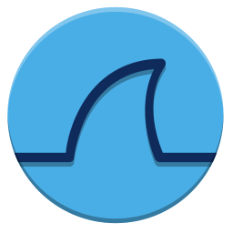

<h1> Hey there :wave:, I'm Isaac! 😎 </h1>
 

## 📌 Current Projects:
  <strong>

  - [Simple Python Infostealer](https://github.com/isaacward1/py-infostealer)

  - [Home Security Server](https://github.com/isaacward1/homeserv-sec)

  - [Wazuh XDR Vuln Management](https://github.com/isaacward1/homeserv-sec/tree/main/Wazuh)
    
  </strong>
 

## 🚀 Future Projects:
  <strong>

  - OPNsense Firewall on KVM
  
  - Privacy VPS Tutorial (WireGuard VPN, Tor Node)

  - PowerShell Ransomware Demo

  </strong>
 

## 📅 Past Projects:
<strong>
  
- [PowerShell File Integrity Monitor](https://github.com/isaacward1/PowerShell-FIM)

- [Active Directory Home Lab](https://github.com/isaacward1/AD-HomeLab)

</strong>
 

## 🐍 Languages & Tools 🛠️:

  
  
  
  
  
  
  
  
  
  
  
  
  
  
  
  
  
  
  

