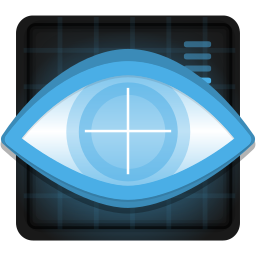

<h1> hey :wave:, i'm Isaac! 😎 </h1>
i use this space to record some of the stuff i do. repos are updated once a century

  

## 📌 Current Projects
  <strong>

  - [Simple Python Infostealer](https://github.com/isaacward1/py-infostealer)

  - [Home Security Server](https://github.com/isaacward1/homeserv-sec)

  - [Wazuh & Metasploitable3](https://github.com/isaacward1/homeserv-sec/tree/main/Wazuh)
    
  </strong>
 

## 🚀 Future Projects
  <strong>

  - OPNsense Firewall on KVM
  
  - DIY VPN Tutorial

  - DNS query monitor (tcpdump + VirusTotal python API)

  - OpenWRT stuff

  </strong>
 

## 📅 Past Projects
<strong>
  
- [PowerShell File Integrity Monitor](https://github.com/isaacward1/PowerShell-FIM)

- [Active Directory Home Lab](https://github.com/isaacward1/AD-HomeLab)

</strong>
 

<!-- ## 🐍 Languages & Tools 🛠️ -->
## 🧸 Toys

  
  
  
  
  
  
  
  
  
  
  
  
  
  
  
  
  
  
  
  

  <!--
  
  
  
  
  -->
